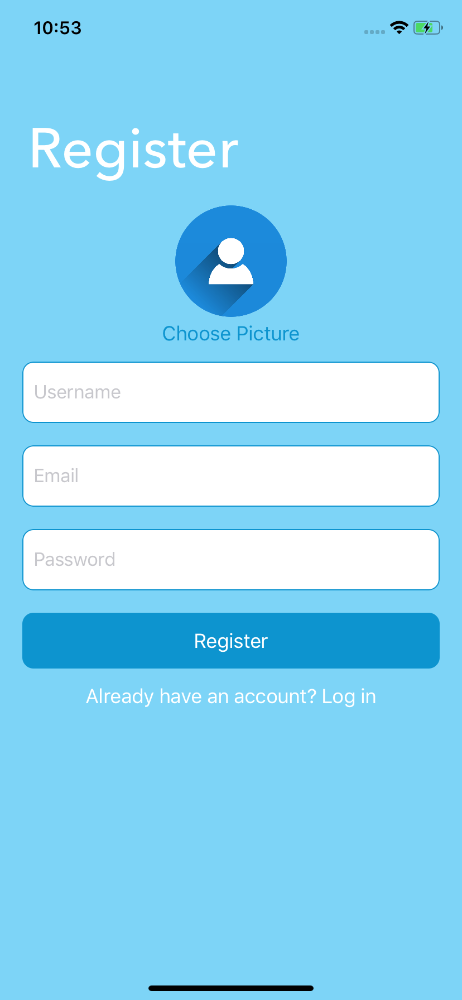
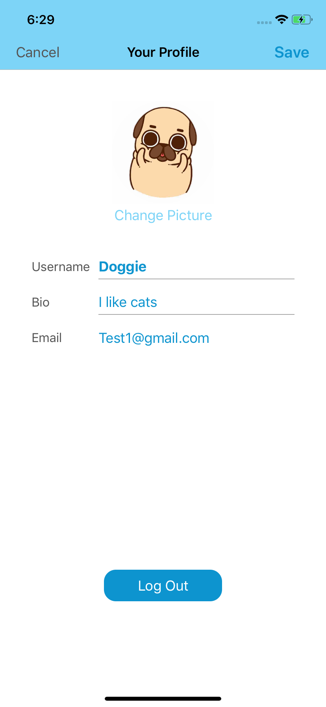
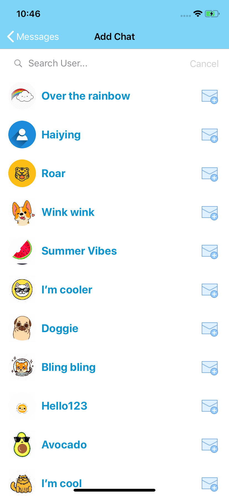
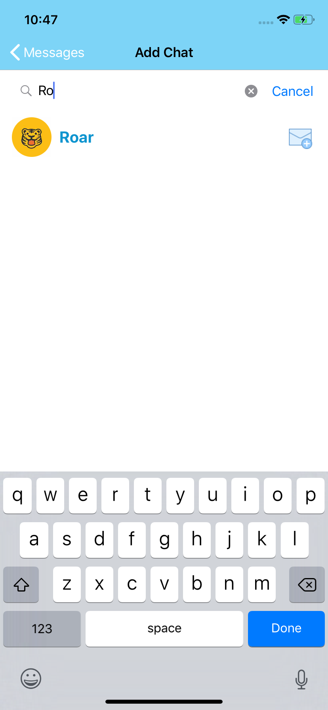
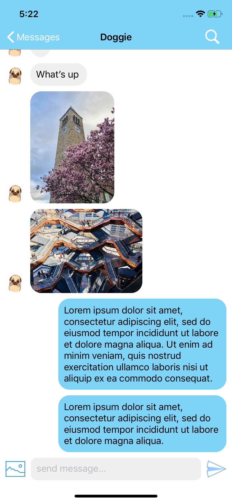
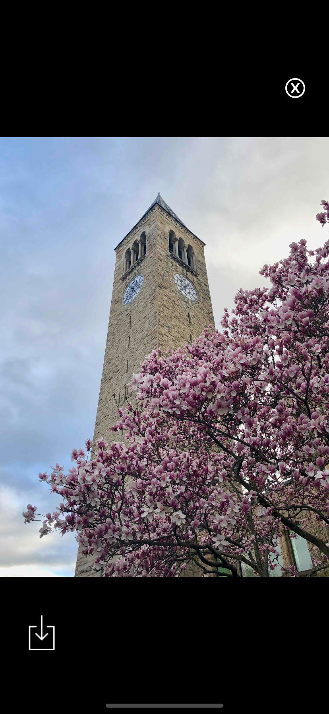
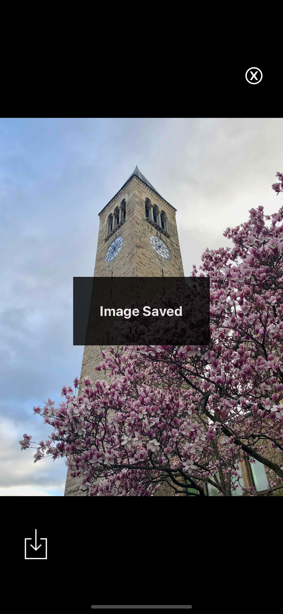
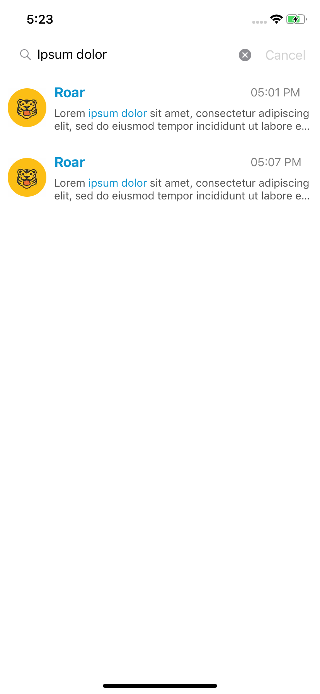

# Breeze
**Breeze is a real-time messaging app built with Firebase.**

**Features** 
 - Login
 - Register an account 
 - Edit personal profile 
 - Search users 
 - Create a conversation
 - Search messages in a conversation
 - View and save images from a conversation 

Login / Register / All Messages / Profile  
     

All Users / Search Users / User Profile  
    

Conversation / Image View / Search in Conversation  
   
