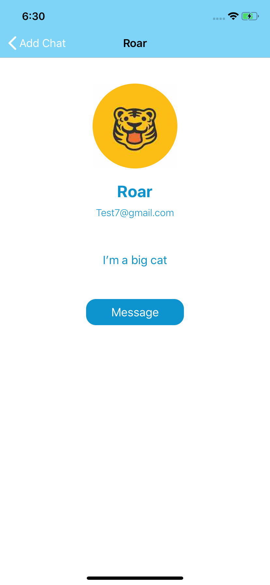

# Breeze
**Breeze is a real-time messaging app built with Firebase.**

The messaging app has features including login, register an account, edit personal profile, search users, create a conversation, and search messages in a conversation. 

Login / Register / All Messages / Profile  
     

All Users / Search Users / User Profile  
    

Conversation / Image View / Search in Conversation  
  
